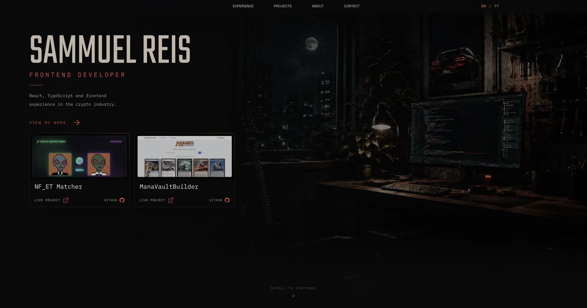

# Portfolio

Personal portfolio showcasing my frontend experience, selected projects, background, and contact links.

[View the live site](https://sammuelgr.vercel.app)

[](https://sammuelgr.vercel.app)

## About

I built this portfolio to share the projects I am proud of, my professional experience, and a little about myself.
It is available in English and Brazilian Portuguese.

## Tech Stack

- React and TypeScript
- Vite and Tailwind CSS
- Motion
- i18next and react-i18next
- Vitest and React Testing Library

## Development

```bash
git clone https://github.com/SammuelGR/portfolio.git
cd portfolio
npm install
npm run dev
```

## Validation

```bash
npm run check
npm run build
```
